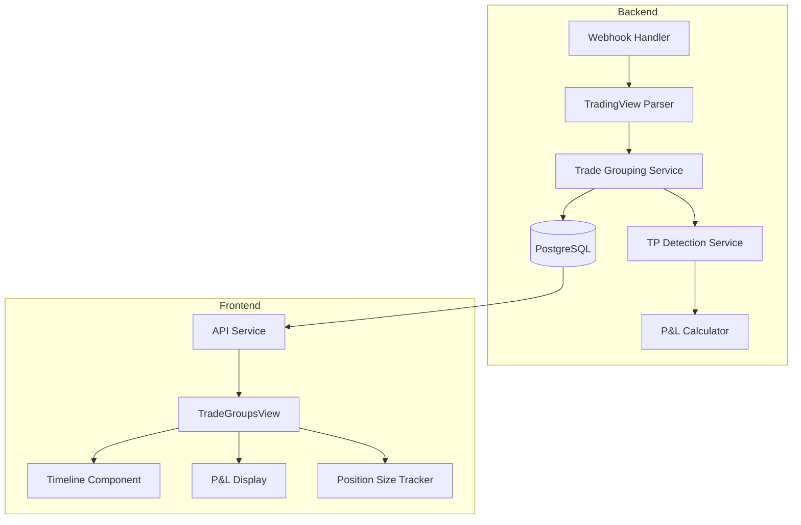

# Design Document: Multi-TP Trade Tracking

## Overview

This feature enhances the existing trade grouping system to provide comprehensive tracking and visualization of multi-take-profit (TP) strategy trades. The core challenge is reliably parsing the complex, nested JSON structure from TradingView webhooks where critical parameters are split between the main payload and an embedded `order_alert_message` string.

The implementation builds on the existing `TradeGroupingService` and `TradeGroupsView` components, with a major focus on robust JSON parsing to handle the variety of webhook formats from different TradingView strategies.

## TradingView Webhook Structure Analysis

Based on real webhook examples, the JSON structure has two layers:

### Layer 1: Main Payload Fields
```json
{
  "ticker": "CVXUSDT",
  "order_action": "sell",
  "order_price": "1.853",
  "order_contracts": "301.333",
  "order_id": "Take 1st Target long",
  "order_comment": "TP1",
  "position_size": "368.298",
  "market_position": "long",
  "timestamp": "2025-12-03T22:49:00Z"
}
```

### Layer 2: Embedded `order_alert_message` (JSON string inside JSON)
```json
{
  "order_alert_message": "\"margin_mode\": \"1\", \"order_type\":\"reduce_long\", \"leverage\":\"6\", \"stop_loss_price\": \"1.783\", \"pyramiding\": \"0\", \"enable_multi_tp\": \"1\""
}
```

### Key Field Locations by Alert Type

| Alert Type | order_type (in alert_message) | order_comment | order_id | position_size | market_position |
|------------|------------------------------|---------------|----------|---------------|-----------------|
| Entry | `enter_long` / `enter_short` | - | - | initial qty | `long` / `short` |
| TP1 | `reduce_long` / `reduce_short` | `TP1` | `Take 1st Target long` | remaining | `long` / `short` |
| TP2 | `reduce_long` / `reduce_short` | `TP2` | `Take 2nd Target long` | remaining | `long` / `short` |
| TP3 | `reduce_long` / `reduce_short` | `TP3` | `Take 3rd Target long` | `0` | `flat` |
| SL | `exit_long` / `exit_short` | `SL` | `Stop Loss` | `0` | `flat` |

### Parsing Priority Rules

1. **order_type**: Always from `order_alert_message.order_type` (determines entry vs reduce vs exit)
2. **TP Level**: First check `order_comment`, then `order_id` pattern matching
3. **Position State**: Use `position_size` + `market_position` together (both must indicate closed)
4. **Leverage/SL**: From `order_alert_message` on entry alerts, cached for the group

## Architecture



## Components and Interfaces

### Backend Components

#### 1. Webhook Normalizer Service (new: `webhook_normalizer.py`)

Central service to normalize the complex nested JSON into a flat, consistent structure.

```python
class WebhookNormalizer:
    """Normalize TradingView webhook payloads into consistent structure."""
    
    @staticmethod
    def normalize(raw_payload: dict) -> NormalizedWebhook:
        """
        Parse and normalize webhook payload from any TradingView strategy format.
        
        Handles:
        - Nested order_alert_message parsing (JSON string inside JSON)
        - Field name variations (order_contracts vs contracts vs quantity)
        - String-to-number conversions for prices/quantities
        - Missing field defaults
        
        Returns NormalizedWebhook with guaranteed fields.
        """
    
    @staticmethod
    def parse_alert_message(alert_message: str) -> dict:
        """
        Parse the order_alert_message field which contains embedded parameters.
        
        Handles malformed JSON like:
        - Missing braces: '"key": "value", "key2": "value2"'
        - Extra quotes: '""key": "value"'
        - Trailing commas
        """
    
    @staticmethod
    def detect_alert_type(normalized: NormalizedWebhook) -> AlertType:
        """
        Determine alert type from normalized data.
        
        Returns: ENTRY, TP1, TP2, TP3, STOP_LOSS, PARTIAL_CLOSE, or UNKNOWN
        
        Logic:
        1. Check order_type for enter_* → ENTRY
        2. Check order_type for reduce_*/exit_* → exit type
        3. For exits, check order_comment first (TP1, TP2, TP3, SL)
        4. Fallback to order_id pattern matching (1st Target, 2nd Target, etc.)
        5. If reduce without markers → PARTIAL_CLOSE
        """

@dataclass
class NormalizedWebhook:
    """Normalized webhook with guaranteed field types."""
    symbol: str
    action: str  # 'buy' or 'sell'
    order_type: str  # 'enter_long', 'reduce_long', 'exit_long', etc.
    alert_type: str  # 'ENTRY', 'TP1', 'TP2', 'TP3', 'SL', 'PARTIAL'
    
    # Prices (always float or None)
    order_price: Optional[float]
    entry_price: Optional[float]  # For entries
    stop_loss_price: Optional[float]
    
    # Quantities (always float or None)
    order_contracts: Optional[float]
    position_size: Optional[float]  # Remaining after this action
    
    # Position state
    market_position: str  # 'long', 'short', 'flat'
    is_position_closed: bool  # True if position_size=0 AND market_position=flat
    
    # Trade parameters
    leverage: Optional[float]
    pyramiding: Optional[int]
    
    # Metadata
    timestamp: datetime
    order_id: Optional[str]
    order_comment: Optional[str]
    raw_payload: dict
```

#### 2. Enhanced Trade Grouping Service (`trade_grouping.py`)

Uses `WebhookNormalizer` for consistent data, focuses on grouping logic.

```python
class TradeGroupingService:
    @staticmethod
    def determine_trade_group(user_id: int, normalized: NormalizedWebhook) -> TradeGroupResult:
        """
        Determine trade group using normalized webhook data.
        
        Returns TradeGroupResult with:
        - trade_group_id
        - trade_direction
        - is_new_group
        - entry_price (cached from entry or looked up)
        """
    
    @staticmethod
    def _find_active_trade_group(user_id: int, symbol: str, direction: str) -> Optional[str]:
        """
        Find active group by checking position_size and market_position.
        
        A group is active if latest webhook has:
        - position_size > 0 OR
        - market_position != 'flat'
        """
```

#### 3. P&L Calculator Service (new: `pnl_calculator.py`)

```python
class PnLCalculator:
    @staticmethod
    def calculate_exit_pnl(entry_price: float, exit_price: float, 
                          direction: str, quantity: float) -> dict:
        """
        Calculate P&L for a single exit.
        Returns: {
            'pnl_percent': float,
            'pnl_absolute': float,
            'quantity': float
        }
        """
    
    @staticmethod
    def calculate_weighted_pnl(exits: List[dict], entry_price: float, 
                               direction: str) -> dict:
        """
        Calculate weighted average P&L across all exits.
        Returns: {
            'total_pnl_percent': float,
            'total_pnl_absolute': float,
            'exits_breakdown': List[dict]
        }
        """
```

### Database Schema Changes

New columns for `webhook_logs` table:

```sql
ALTER TABLE webhook_logs
ADD COLUMN IF NOT EXISTS tp_level VARCHAR(10),           -- 'TP1', 'TP2', 'TP3', 'SL', 'PARTIAL'
ADD COLUMN IF NOT EXISTS position_size_after FLOAT,      -- Remaining position after this action
ADD COLUMN IF NOT EXISTS entry_price FLOAT,              -- Cached entry price for the group
ADD COLUMN IF NOT EXISTS realized_pnl_percent FLOAT,     -- P&L % for this specific exit
ADD COLUMN IF NOT EXISTS realized_pnl_absolute FLOAT;    -- P&L $ for this specific exit
```

### Frontend Components

#### 1. Enhanced TradeGroupsView

```typescript
interface TradeGroup {
  groupId: string;
  symbol: string;
  direction: 'long' | 'short';
  status: 'ACTIVE' | 'CLOSED';
  entryPrice: number;
  entryQuantity: number;
  leverage: number;
  stopLoss?: number;
  trades: TradeEntry[];
  summary: TradeSummary;
}

interface TradeEntry {
  id: number;
  timestamp: string;
  action: 'buy' | 'sell';
  tpLevel: 'Entry' | 'TP1' | 'TP2' | 'TP3' | 'SL' | 'Partial';
  price: number;
  quantity: number;
  positionSizeAfter: number;
  pnlPercent?: number;
  pnlAbsolute?: number;
}

interface TradeSummary {
  totalPnlPercent: number;
  totalPnlAbsolute: number;
  duration: string;
  tpLevelsHit: string[];
  exitType: 'TP' | 'SL' | 'MANUAL';
}
```

#### 2. Timeline Component Enhancements

- Visual progress bar showing position reduction through TPs
- Individual P&L badges for each TP level
- Position size indicator after each action
- Duration display between entry and final exit

## Data Models

### Webhook Log Extended Model

```python
class WebhookLog(db.Model):
    # Existing fields...
    
    # New fields for TP tracking
    tp_level = db.Column(db.String(10))           # 'TP1', 'TP2', 'TP3', 'SL', 'PARTIAL'
    position_size_after = db.Column(db.Float)      # Remaining position
    entry_price = db.Column(db.Float)              # Entry price (cached for exits)
    realized_pnl_percent = db.Column(db.Float)     # P&L % for this exit
    realized_pnl_absolute = db.Column(db.Float)    # P&L $ for this exit
```

### Trade Group Summary (computed, not stored)

```python
@dataclass
class TradeGroupSummary:
    group_id: str
    symbol: str
    direction: str
    entry_price: float
    entry_quantity: float
    leverage: float
    stop_loss: Optional[float]
    status: str  # 'ACTIVE' or 'CLOSED'
    trades: List[WebhookLog]
    total_pnl_percent: float
    total_pnl_absolute: float
    duration_seconds: int
    tp_levels_hit: List[str]
```


## Correctness Properties

*A property is a characteristic or behavior that should hold true across all valid executions of a system-essentially, a formal statement about what the system should do. Properties serve as the bridge between human-readable specifications and machine-verifiable correctness guarantees.*

### Property 0: Alert Message Parsing Round-Trip
*For any* valid `order_alert_message` string (with or without braces, with various quote styles), parsing then re-serializing the extracted key-value pairs shall preserve all original values.

**Validates: Requirements 4.1, 4.2 (parsing foundation)**

### Property 1: Position Size Extraction
*For any* webhook payload containing a `position_size` field (as string or number), the system shall correctly parse and store the numeric value in `position_size_after`.

**Validates: Requirements 1.1**

### Property 2: Trade Group Closure Detection
*For any* trade group where the latest webhook has `position_size` = "0" AND `market_position` = "flat", the system shall return status = "CLOSED".

**Validates: Requirements 1.3**

### Property 3: New Group After Flat Position
*For any* sequence of webhooks where an entry alert follows a flat position for the same symbol, the system shall assign a different `trade_group_id` to the new entry.

**Validates: Requirements 1.4**

### Property 4: P&L Calculation Correctness
*For any* exit with entry_price, exit_price, and direction, the P&L percentage shall equal:
- For longs: `((exit_price - entry_price) / entry_price) * 100`
- For shorts: `((entry_price - exit_price) / entry_price) * 100`

**Validates: Requirements 2.1, 2.2**

### Property 5: Weighted Average P&L
*For any* closed trade group with multiple exits, the total P&L shall equal the sum of (individual_pnl * quantity) divided by total_quantity.

**Validates: Requirements 2.4**

### Property 6: Chronological Ordering
*For any* trade group, the trades array shall be sorted by timestamp in ascending order.

**Validates: Requirements 3.1**

### Property 7: TP Level Detection from order_comment
*For any* webhook where `order_comment` contains "TP1", "TP2", or "TP3" (case-insensitive), the system shall set `tp_level` to the matching value.

**Validates: Requirements 4.1**

### Property 8: TP Level Detection from order_id
*For any* webhook where `order_id` contains "1st Target", "2nd Target", or "3rd Target", the system shall map to "TP1", "TP2", "TP3" respectively.

**Validates: Requirements 4.2**

### Property 9: order_comment Precedence
*For any* webhook with both `order_comment` and `order_id` containing TP indicators, the `tp_level` shall be determined by `order_comment`.

**Validates: Requirements 4.4**

### Property 10: Reduce Without TP Markers
*For any* webhook with `order_type` containing "reduce" but no TP identifiers in `order_comment` or `order_id`, the system shall set `tp_level` to "PARTIAL".

**Validates: Requirements 4.3**

### Property 11: Entry Metadata Extraction
*For any* entry webhook containing `leverage` and/or `stop_loss_price`, these values shall be stored and accessible in the trade group.

**Validates: Requirements 5.1, 5.2**

### Property 12: Concurrent Trade Separation
*For any* new entry alert arriving while an existing trade group for the same symbol is still open (not flat), the system shall create a new trade group with a unique ID.

**Validates: Requirements 6.1, 6.3**

### Property 13: Webhook Normalization Completeness
*For any* raw TradingView webhook payload (with nested order_alert_message), the normalizer shall extract and populate all required NormalizedWebhook fields without raising exceptions.

**Validates: Requirements 1.1, 4.1, 4.2, 5.1, 5.2**

### Property 14: Order Type Detection
*For any* webhook where `order_alert_message` contains `order_type` with value `enter_long`, `enter_short`, `reduce_long`, `reduce_short`, `exit_long`, or `exit_short`, the normalizer shall correctly extract and classify the order type.

**Validates: Requirements 1.4, 4.3**

## Error Handling

### Backend Error Handling

1. **Missing Position Size**: If `position_size` is missing from a reduce alert, log a warning and set `position_size_after` to `None`. The UI will display "N/A".

2. **Invalid Price Values**: If entry or exit prices cannot be parsed as floats, skip P&L calculation and log the error. Display "P&L unavailable" in UI.

3. **Orphaned Exits**: If a reduce alert cannot be matched to an active trade group, create a new "orphaned" group with a warning flag.

4. **Duplicate Webhooks**: Detect duplicate webhooks by comparing timestamp + symbol + order_id within a 5-second window. Skip duplicates.

### Frontend Error Handling

1. **Missing Data**: Display "N/A" or "-" for missing fields rather than crashing.

2. **API Errors**: Show toast notification and retry with exponential backoff.

3. **Malformed Groups**: Filter out groups with no valid trades from display.

## Testing Strategy

### Property-Based Testing

We will use **Hypothesis** (Python) for backend property-based testing. Each correctness property will be implemented as a separate property test.

Configuration:
- Minimum 100 iterations per property test
- Each test tagged with: `**Feature: multi-tp-trade-tracking, Property {N}: {description}**`

### Unit Tests

Unit tests will cover:
- Edge cases for TP level detection (empty strings, unusual formats)
- P&L calculation with edge values (zero prices, negative scenarios)
- Trade group status transitions

### Integration Tests

- End-to-end webhook processing flow
- API endpoint responses for trade groups
- WebSocket updates for real-time position changes
