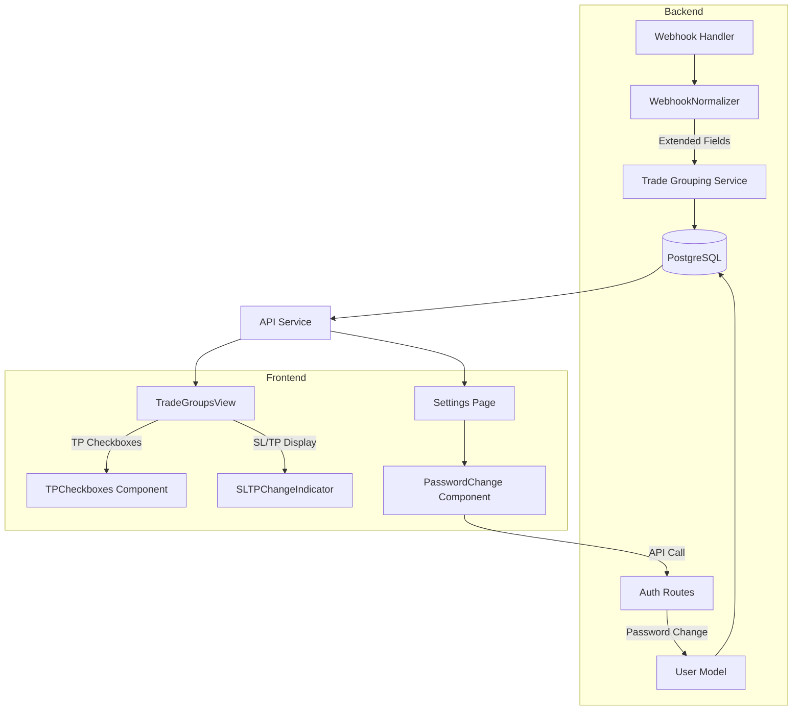

# Design Document: Trade Enhancements

## Overview

This feature enhances the TradingView webhook trading system with four key improvements:

1. **SL/TP Change Tracking** - Track and display stop loss and take profit value changes from webhook updates
2. **Flexible JSON Format Support** - Handle different webhook formats from various TradingView strategies (including OANDA-style with `exit_stop`, `exit_limit`, `ticker`, etc.)
3. **TP Hit Checkbox System** - Visual checkboxes showing which take profit levels have been hit
4. **Password Management** - Allow users to change passwords in settings

The implementation extends the existing `WebhookNormalizer` to handle additional TradingView fields, adds new database columns for tracking SL/TP changes, enhances the frontend `TradeGroupsView` with TP checkboxes, and adds a password change API endpoint.

## Architecture



## Components and Interfaces

### Backend Components

#### 1. Enhanced WebhookNormalizer (`webhook_normalizer.py`)

Extend the existing normalizer to handle additional TradingView strategy fields.

```python
@dataclass
class NormalizedWebhook:
    # Existing fields...
    
    # New exit strategy fields
    exit_stop: Optional[float] = None        # TradingView exit_stop field
    exit_limit: Optional[float] = None       # TradingView exit_limit field  
    exit_loss_ticks: Optional[float] = None  # Exit loss in ticks
    exit_profit_ticks: Optional[float] = None # Exit profit in ticks
    exit_trail_price: Optional[float] = None  # Trailing stop price
    exit_trail_offset: Optional[float] = None # Trailing stop offset
    
    # Custom indicator values
    plot_values: Dict[str, float] = field(default_factory=dict)  # plot_0, plot_1, etc.


class WebhookNormalizer:
    @staticmethod
    def normalize(raw_payload: dict) -> NormalizedWebhook:
        """
        Extended to handle:
        - exit_stop → maps to stop_loss_price
        - exit_limit → maps to take_profit_price  
        - ticker → maps to symbol
        - position_avg_price → maps to entry_price
        - exit_trail_price, exit_trail_offset → trailing stop params
        - plot_0, plot_1, etc. → custom indicator values
        """
```

#### 2. Password Change API (`auth.py`)

New endpoint for password management.

```python
@bp.route('/change-password', methods=['POST'])
@jwt_required()
def change_password():
    """
    Change user password.
    
    Request body:
    - current_password: Required for self-change
    - new_password: New password (min 8 chars)
    - user_id: Optional, for admin changing another user's password
    
    Returns:
    - 200: Password changed successfully
    - 400: Validation error (password too short)
    - 401: Current password incorrect
    - 403: Not authorized to change this user's password
    """
```

### Database Schema Changes

New columns for `webhook_logs` table:

```sql
-- Migration 008: Add SL/TP tracking and trailing stop fields
ALTER TABLE webhook_logs
ADD COLUMN IF NOT EXISTS current_stop_loss FLOAT,      -- Current SL value at this webhook
ADD COLUMN IF NOT EXISTS current_take_profit FLOAT,    -- Current TP value at this webhook
ADD COLUMN IF NOT EXISTS exit_trail_price FLOAT,       -- Trailing stop price
ADD COLUMN IF NOT EXISTS exit_trail_offset FLOAT,      -- Trailing stop offset
ADD COLUMN IF NOT EXISTS sl_changed BOOLEAN DEFAULT FALSE,  -- Flag if SL changed from previous
ADD COLUMN IF NOT EXISTS tp_changed BOOLEAN DEFAULT FALSE;  -- Flag if TP changed from previous
```

### Frontend Components

#### 1. TPCheckboxes Component (new)

```typescript
interface TPCheckboxesProps {
  trades: TradeEntry[];
  tpLevels: ('TP1' | 'TP2' | 'TP3')[];
}

interface TPHitInfo {
  level: string;
  isHit: boolean;
  timestamp?: string;
  exitPrice?: number;
  pnlPercent?: number;
}

const TPCheckboxes: React.FC<TPCheckboxesProps> = ({ trades, tpLevels }) => {
  // Returns checkbox indicators for each TP level
  // Checked = TP was hit, Unchecked = TP not hit
  // Tooltip shows hit details on hover
}
```

#### 2. SLTPChangeIndicator Component (new)

```typescript
interface SLTPChangeIndicatorProps {
  currentSL?: number;
  previousSL?: number;
  currentTP?: number;
  previousTP?: number;
  trailPrice?: number;
  trailOffset?: number;
}

const SLTPChangeIndicator: React.FC<SLTPChangeIndicatorProps> = (props) => {
  // Shows SL/TP values with change highlighting
  // Arrow indicators for value changes (↑ increased, ↓ decreased)
}
```

#### 3. PasswordChange Component (new)

```typescript
interface PasswordChangeProps {
  userId?: number;  // Optional: for admin changing another user
}

const PasswordChange: React.FC<PasswordChangeProps> = ({ userId }) => {
  // Form with current password, new password, confirm password
  // Validation for minimum length
  // Success/error feedback
}
```

## Data Models

### Extended WebhookLog Model

```python
class WebhookLog(db.Model):
    # Existing fields...
    
    # New SL/TP tracking fields
    current_stop_loss = db.Column(db.Float)      # SL value at this webhook
    current_take_profit = db.Column(db.Float)    # TP value at this webhook
    exit_trail_price = db.Column(db.Float)       # Trailing stop price
    exit_trail_offset = db.Column(db.Float)      # Trailing stop offset
    sl_changed = db.Column(db.Boolean, default=False)  # SL changed flag
    tp_changed = db.Column(db.Boolean, default=False)  # TP changed flag
    
    def to_dict(self):
        # Extended to include new fields
```

### TP Hit Status (computed)

```python
@dataclass
class TPHitStatus:
    """Computed TP hit status for a trade group."""
    tp1_hit: bool = False
    tp1_timestamp: Optional[datetime] = None
    tp1_price: Optional[float] = None
    
    tp2_hit: bool = False
    tp2_timestamp: Optional[datetime] = None
    tp2_price: Optional[float] = None
    
    tp3_hit: bool = False
    tp3_timestamp: Optional[datetime] = None
    tp3_price: Optional[float] = None
    
    all_tps_complete: bool = False  # True if all configured TPs hit
```

## Correctness Properties

*A property is a characteristic or behavior that should hold true across all valid executions of a system-essentially, a formal statement about what the system should do. Properties serve as the bridge between human-readable specifications and machine-verifiable correctness guarantees.*

### Property 1: Exit Strategy Field Extraction
*For any* webhook payload containing `exit_stop`, `exit_limit`, `exit_loss_ticks`, or `exit_profit_ticks` fields (as strings or numbers), the normalizer shall correctly parse and store these values as floats.

**Validates: Requirements 1.1, 1.2**

### Property 2: Field Mapping Consistency
*For any* webhook payload containing `exit_stop` or `exit_limit`, the normalizer shall map `exit_stop` to `stop_loss_price` and `exit_limit` to `take_profit_price` in the normalized output.

**Validates: Requirements 2.1**

### Property 3: Trailing Stop Extraction
*For any* webhook payload containing `exit_trail_price` and/or `exit_trail_offset` fields, the normalizer shall correctly extract and store these values.

**Validates: Requirements 2.2, 5.1, 5.2**

### Property 4: Symbol Field Aliasing
*For any* webhook payload, if `ticker` is present and `symbol` is absent, the normalizer shall use `ticker` as the symbol value. If both are present, `symbol` takes precedence.

**Validates: Requirements 2.3**

### Property 5: Entry Price from Position Average
*For any* webhook payload containing `position_avg_price`, the normalizer shall use this value as `entry_price` when no explicit `entry_price` field is present.

**Validates: Requirements 2.4**

### Property 6: Plot Values Extraction
*For any* webhook payload containing fields matching pattern `plot_N` (where N is a digit), the normalizer shall extract all such fields into the `plot_values` dictionary.

**Validates: Requirements 2.5**

### Property 7: Type Coercion for Prices and Quantities
*For any* webhook payload where price or quantity fields are provided as strings, the normalizer shall correctly parse them to float values. For any payload where they are provided as numbers, they shall be preserved as floats.

**Validates: Requirements 2.6**

### Property 8: Most Recent SL/TP Selection
*For any* trade group with multiple webhooks, the displayed SL and TP values shall be from the most recent webhook (by timestamp) that contains non-null values for those fields.

**Validates: Requirements 1.5**

### Property 9: SL/TP Change Detection
*For any* two consecutive webhooks in a trade group, if the SL or TP value differs, the `sl_changed` or `tp_changed` flag shall be set to true on the later webhook.

**Validates: Requirements 1.3**

### Property 10: TP Hit Detection
*For any* trade group, a TP level (TP1, TP2, TP3) shall be marked as "hit" if and only if there exists a webhook in the group with `tp_level` equal to that TP level.

**Validates: Requirements 3.2**

### Property 11: All TPs Complete Detection
*For any* trade group where TP1, TP2, and TP3 are all marked as hit, the `all_tps_complete` flag shall be true. For any trade group missing at least one TP hit, the flag shall be false.

**Validates: Requirements 3.5**

### Property 12: Password Verification Requirement
*For any* password change request where the requesting user is changing their own password, the request shall fail if `current_password` is not provided or is incorrect.

**Validates: Requirements 4.2**

### Property 13: Password Minimum Length Validation
*For any* password change request, if the new password is less than 8 characters, the request shall be rejected with a validation error.

**Validates: Requirements 4.3**

### Property 14: Password Hashing
*For any* successful password change, the stored `password_hash` shall be a valid bcrypt hash (starting with `$2b$` or `$2a$`) and shall not equal the plaintext password.

**Validates: Requirements 4.4**

## Error Handling

### Backend Error Handling

1. **Missing Exit Strategy Fields**: If `exit_stop`, `exit_limit`, etc. are missing, set corresponding normalized fields to `None`. Do not fail parsing.

2. **Invalid Price/Quantity Strings**: If a string value cannot be parsed to float, log a warning and set to `None`. Continue processing other fields.

3. **Password Change Failures**:
   - Wrong current password: Return 401 with generic "Invalid credentials" message
   - Password too short: Return 400 with "Password must be at least 8 characters"
   - Unauthorized: Return 403 with "Not authorized to change this password"

4. **Trailing Stop Missing Fields**: If only one of `exit_trail_price` or `exit_trail_offset` is present, store the available value and set the other to `None`.

### Frontend Error Handling

1. **Missing TP Data**: Display unchecked checkbox with "Not hit" tooltip
2. **Missing SL/TP Values**: Display "N/A" instead of empty
3. **Password Change Errors**: Display error message from API, clear password fields

## Testing Strategy

### Property-Based Testing

We will use **Hypothesis** (Python) for backend property-based testing. Each correctness property will be implemented as a separate property test.

Configuration:
- Minimum 100 iterations per property test
- Each test tagged with: `**Feature: trade-enhancements, Property {N}: {description}**`

### Unit Tests

Unit tests will cover:
- Edge cases for field extraction (empty strings, null values, unusual formats)
- Password validation edge cases (exactly 8 chars, special characters)
- TP hit detection with various trade group configurations

### Integration Tests

- End-to-end webhook processing with new fields
- Password change flow (success and failure cases)
- API responses include new SL/TP tracking fields

